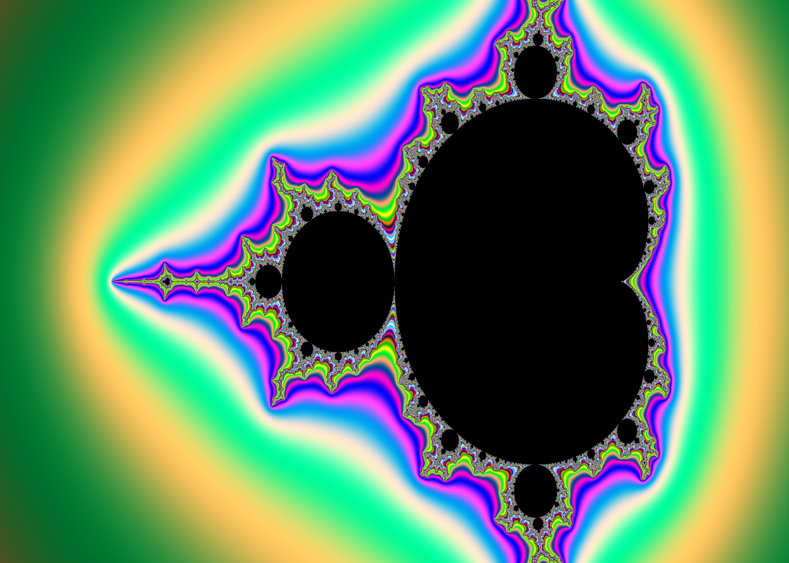
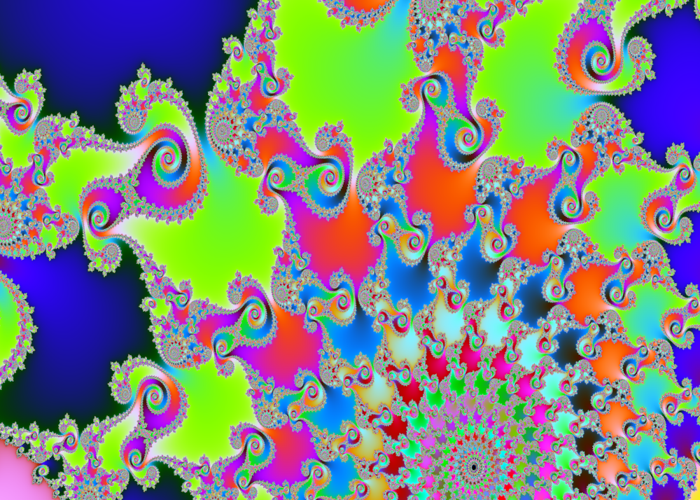

# mandelbrot-gen
Mandelbrot fractal generator.

## Status
Working on this whenever I feel like it. Plans include:

- Other coloring related additions to the algorithm
- CLI interface (not difficult, just haven't done it yet for some reason)
- Deep zooms
- Parallel processing
  - For learning purposes and speed: Parallel processing using a GPU

## Dependencies
- gcc
- libpng

## Building
`make clean && make build`

## Running
`make run` -- All this does is run the executable that was outputted in the build dir.

Open the mandel.png file in your current working directory, and there it is!

## Optional CLI arguments
- `-i` - Specify number of iterates.
- `-z` - Zoom scale. e.g. `-z 2` to double zoom on both axes.
- `-x` - Offset from minimum x (all the way to the left in default settings).
- `-y` - Offset from minimum y (all the way to the bottom in default settings).

Example: `./build/mandel -i 10000 -x 1.001013 -y 0.817897 -z 80000`

## License
[GNU GPL v3.0](LICENSE)
