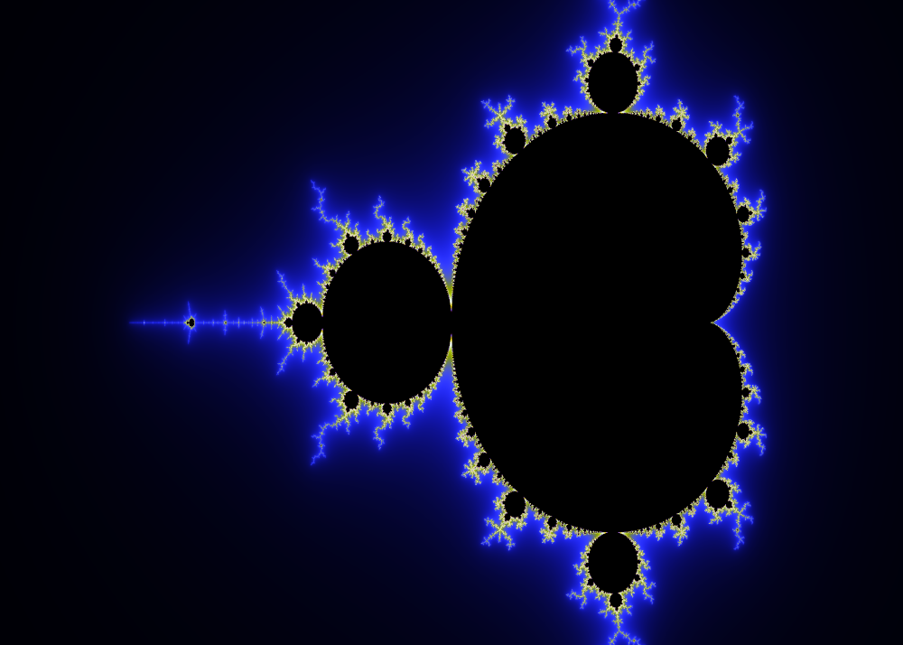

# mandelbrot-gen
Mandelbrot fractal generator.

## Status

Working on this whenever I feel like it. Plans include:

- Other coloring related additions to the algorithm
- CLI interface (not difficult, just haven't done it yet for some reason)
- Deep zooms
- Parallel processing
  - For learning purposes and speed: Parallel processing with NVIDIA's cuda toolkit.

## Dependencies
- gcc
- libpng

## Building

`make clean && make build`

## Running

`make run` -- All this does is run the executable that was outputted in the build dir.

Open the mandel.png file in your current working directory, and there it is!

## License
[GNU GPL v3.0](LICENSE)
